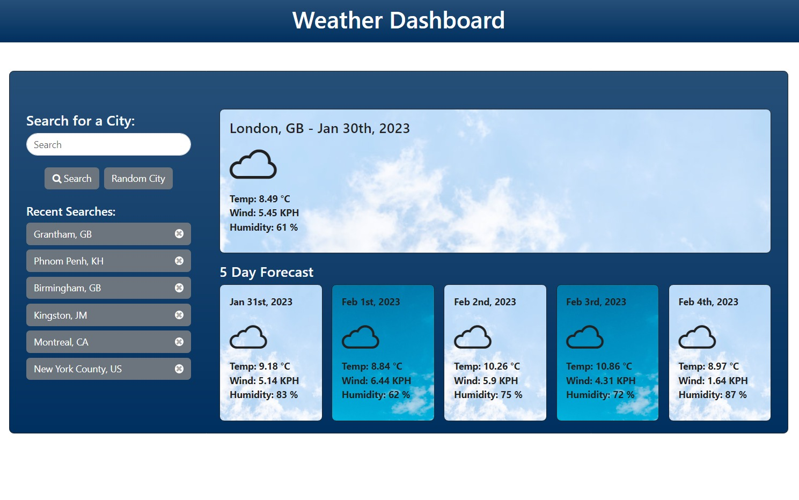

# Weather Dashboard


## Description

A modern weather dashboard built with Vite and JavaScript. This project provides real-time weather data, highlights, and visualizations using APIs like OpenWeather and Unsplash. It features a responsive design, custom weather icons, and dynamic background images based on current weather conditions.

## Features

- **Search by City:** Users can enter a city name to retrieve weather information.
- **Current Weather:** Displays the current temperature, humidity, wind speed, and UV index.
- **5-Day Forecast:** Provides a 5-day forecast with temperature, humidity, and weather conditions.
- **Search History:** Stores the user's search history, allowing them to quickly access previously searched cities.
- **Responsive Design:** The application is designed to work well on various screen sizes, including desktops, tablets, and mobile devices.
- **Clear and concise:** The information is displayed in a clear and easy to read manner.

## Technologies Used

- **HTML:** For structuring the web page.
- **CSS:** For styling the web page and making it visually appealing.
- **JavaScript:** For handling user interactions, fetching data from the API, and updating the page dynamically.
- **OpenWeatherMap API:** For retrieving weather data.
- **Bootstrap:** For responsive design and pre-built UI components.
- **Local Storage:** For storing the search history.

## Installation

1.  Clone the repository to your local machine:
    ```bash
    git clone https://github.com/leightongrant/weather_dashboard.git
    ```
2.  npm i
3.  npm run build
4.  npm preview

## Usage

1.  Enter the name of a city in the search bar.
2.  Click the "Search" button or press Enter.
3.  The current weather and 5-day forecast for the city will be displayed.
4.  Previously searched cities will appear in the search history below the search bar.
5.  Click on a city in the search history to see its weather.

## Screenshots

<a href="https://misterouija.github.io/Weather-Dashboard/"></a>

## Built With


## Contributing

Contributions are welcome! If you'd like to contribute to the project, please follow these steps:

1.  Fork the repository.
2.  Create a new branch for your feature or bug fix.
3.  Make your changes and commit them.
4.  Push your changes to your forked repository.
5.  Submit a pull request.

## License

This project is licensed under the MIT License - see the LICENSE file for details.

## Contact

If you have any questions or suggestions, please feel free to contact me:

- **GitHub:** https://github.com/leightongrant
- **Email:** dev@leightongrant.me

## Acknowledgements

- OpenWeatherMap for providing the weather data API.
- Bootstrap for the CSS framework.
